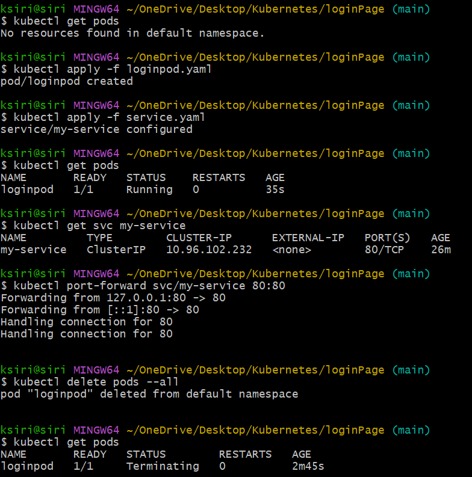
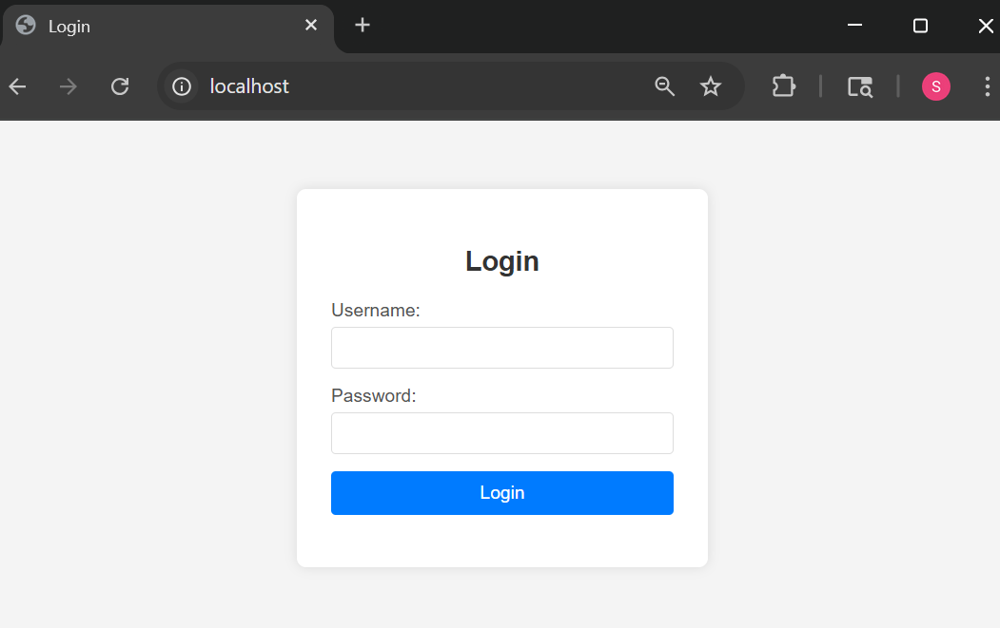
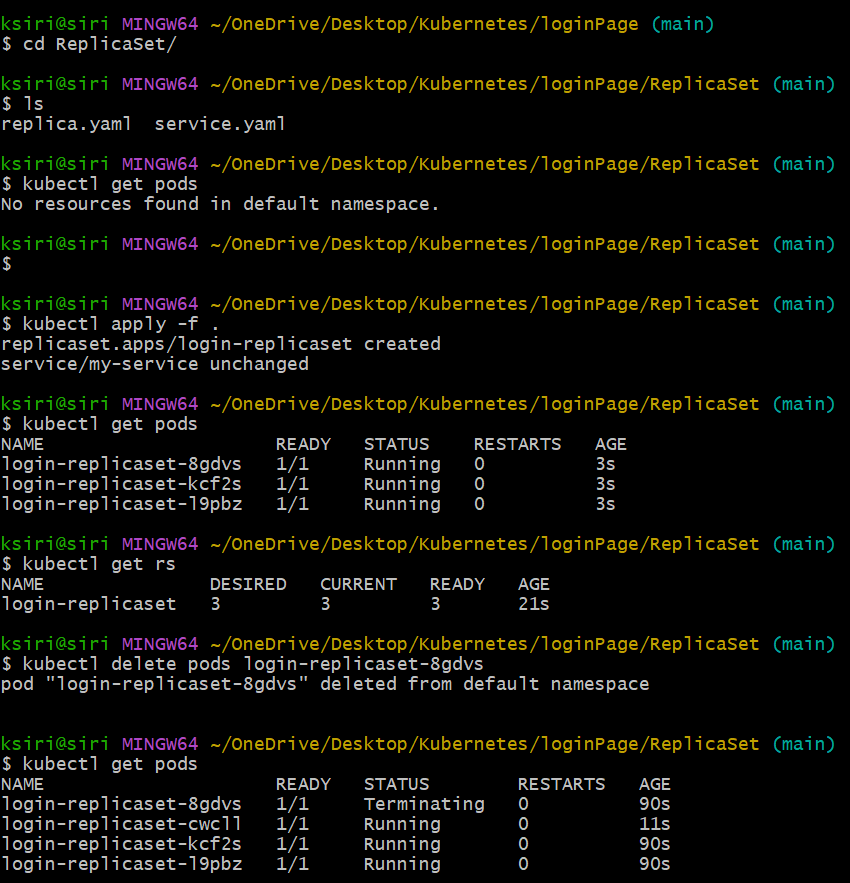
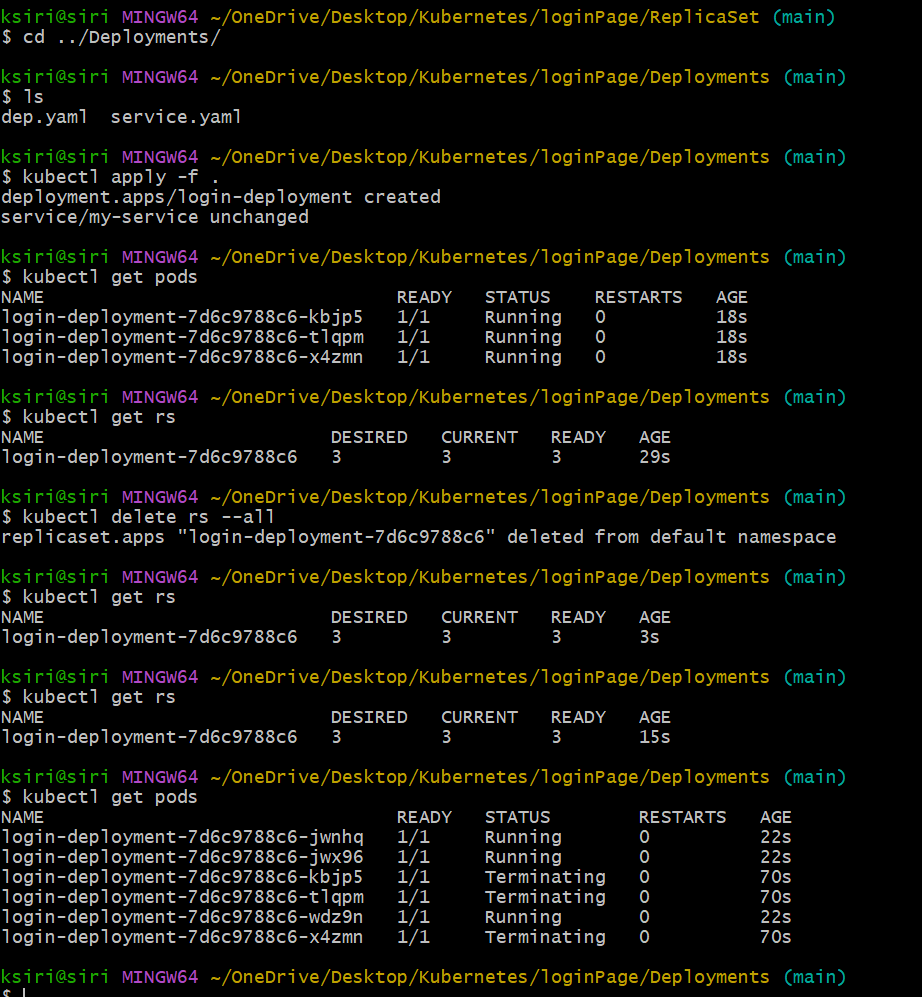
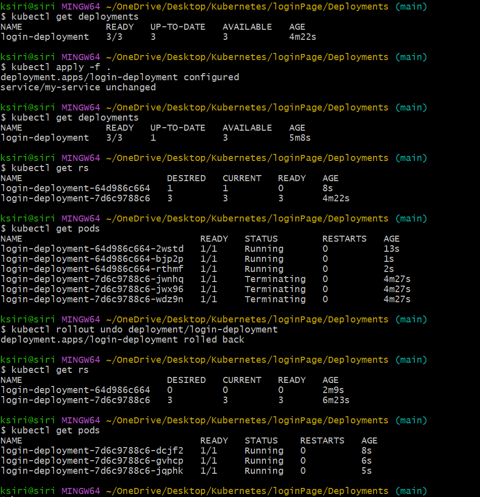
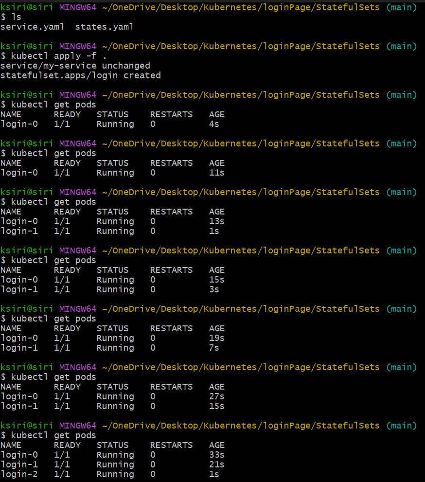

# Kubernetes
Implementing a simple HTML login page using Kubernetes Pod and Service in KIND(Kubernetes IN Docker).
Docker image used: siri019/simple-html-login-page:v1.1
loginpod.yaml - To create a Pod
service.yaml - To create a Service of type NodePort to expose the Pod
Each pod must be connected to a Service to be accessible outside the cluster.

## Steps to create Pod:
1. Install KIND and create a cluster.
2. Create a Pod using the command: `kubectl apply -f loginpod.yaml`
3. Create a Service using the command: `kubectl apply -f service.yaml`
4. Get the NodePort assigned to the Service using the command: `kubectl get svc my-service`
5. port forwarding: `kubectl port-forward svc/my-service <NodePort>:80` -- if you want to access the service locally without using NodeIP.
6. Access the login page using the URL: `http://localhost:<NodePort>`
7. To delete the Pod and Service, use the commands: `kubectl delete -f loginpod.yaml` and `kubectl delete -f service.yaml`
8. To delete the KIND cluster, use the command: `kind delete cluster`

## Implementing ReplicatSets
ReplicaSets ensure that a specified number of pod replicas are running at any given time. If a pod fails or is deleted, the ReplicaSet automatically creates a new pod to maintain the desired state.
ReplicaSets are useful for ensuring high availability and fault tolerance of applications.

Steps:
1. Create a ReplicaSet using the command: `kubectl apply -f replica.yaml`
2. Verify the ReplicaSet and Pods using the command: `kubectl get rs` and `kubectl get pods`

## Implementing Deployments
Deployments provide declarative updates for Pods and ReplicaSets. They allow you to define the desired state of your application, and the Deployment controller automatically manages the creation, scaling, and updating of Pods to match that state.
Difference between ReplicaSet and Deployment:
- A ReplicaSet ensures that a specified number of pod replicas are running at any given time, while a Deployment provides declarative updates for Pods and ReplicaSets.
- A ReplicaSet is primarily responsible for maintaining the desired number of replicas, while a Deployment manages the lifecycle of the application, including rolling updates and rollbacks.   

Steps:
1. Create a Deployment using the command: `kubectl apply -f deployment.yaml`
2. Verify the Deployment and Pods using the command: `kubectl get deployments` and `kubectl get pods`

3. To update the Deployment, modify the image version in the deployment.yaml file and apply the changes using the command: `kubectl apply -f deployment.yaml`
4. Verify the updated Deployment and Pods using the command: `kubectl get deployments`, `kubectl get rs`, and `kubectl get pods`
5. To rollback to a previous version, use the command: `kubectl rollout undo deployment/login-deployment`

## Implementing StatefulSets
StatefulSets are used to manage stateful applications that require stable, unique network identifiers and persistent storage. They provide guarantees about the ordering and uniqueness of pod replicas, making them suitable for applications like databases and distributed systems.
Steps:
1. Create a StatefulSet using the command: `kubectl apply -f statefulset.yaml`
2. Verify the StatefulSet and Pods using the command: `kubectl get statefulsets` and `kubectl get pods`

3. To update the StatefulSet, modify the image version in the statefulset.yaml file and apply the changes using the command: `kubectl apply -f statefulset.yaml`
4. Verify the updated StatefulSet and Pods using the command: `kubectl get statefulsets` and `kubectl get pods`
5. To delete the StatefulSet and its associated Pods, use the command: `kubectl delete -f statefulset.yaml` 

## Implementing DemonSets
DaemonSets ensure that a copy of a pod runs on all (or some) nodes in a Kubernetes cluster. They are typically used for deploying system-level services, such as log collection or monitoring agents, that need to run on every node.
(To send /var/lib/docker/containers logs to ELK stack, we need to deploy Filebeat as a DaemonSet on all nodes in the cluster.)
Steps:
1. Create a DaemonSet using the command: `kubectl apply -f daemonset.yaml`
2. Verify the DaemonSet and Pods using the command: `kubectl get daemonsets` and `kubectl get pods`

## Implementing ConfigMaps
ConfigMaps are used to store configuration data(Envronment variables) in key-value pairs. They allow you to decouple configuration from application code, making it easier to manage and update configurations without modifying the application itself.
Steps:
1. Create a ConfigMap using the command: `kubectl apply -f configmap.yaml`
2. Verify the ConfigMap using the command: `kubectl get configmaps`
3. Create a Pod that uses the ConfigMap using the command: `kubectl apply -f pod-using-configmap.yaml`
4. Verify the Pod using the command: `kubectl get pods`
5. To view the environment variables in the Pod, use the command: `kubectl exec -it <pod-name> -- printenv`

## Implementing Secrets
Secrets are used to store sensitive information, such as passwords, API keys, and certificates. They provide a secure way to manage and distribute sensitive data within a Kubernetes cluster.
Steps:  
1. Create a Secret using the command: `kubectl apply -f secret.yaml`
2. Verify the Secret using the command: `kubectl get secrets`
3. Create a Pod that uses the Secret using the command: `kubectl apply -f pod-using-secret.yaml`
4. Verify the Pod using the command: `kubectl get pods`
5. To view the environment variables in the Pod, use the command: `kubectl exec -it <pod-name> -- printenv`

## Implementing Limits and Requests
Resource requests and limits are used to manage the resource allocation for containers in a Kubernetes cluster. Requests specify the minimum amount of resources required for a container to run, while limits define the maximum amount of resources that a container can use.

Requests: to tell node to assign specified amount of storage to the pod.
Limits: to tell pod to use only specified amount of storage and not beyond.

Steps:
1. Create a Pod with resource requests and limits using the command: `kubectl apply -f pod-with-limits.yaml`
2. Verify the Pod using the command: `kubectl get pods`
3. To view the resource usage of the Pod, use the command: `kubectl top pod <pod-name>`