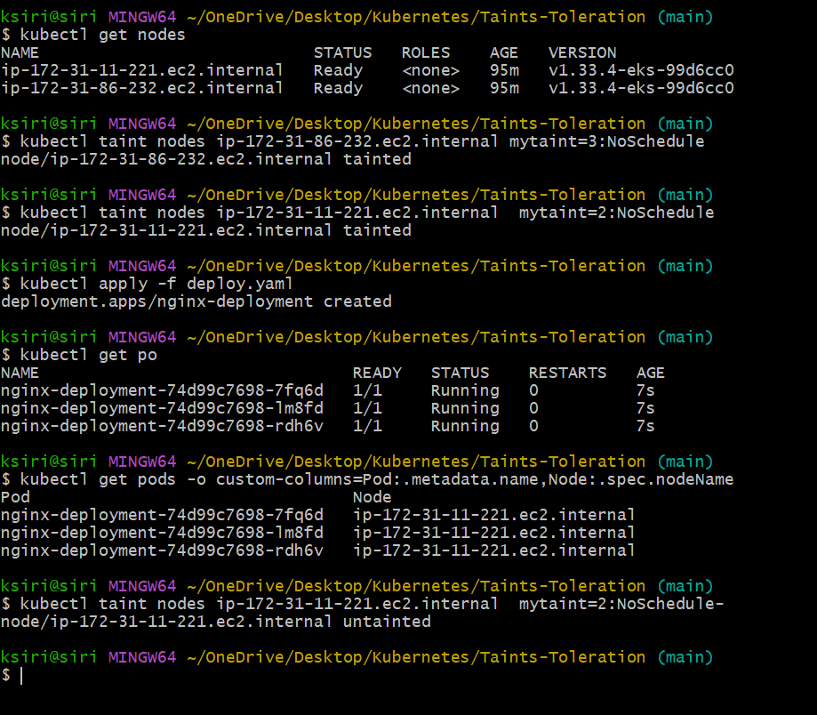

## Taint and Toleration
Taints and tolerations are used to control the scheduling of pods onto nodes in a Kubernetes cluster. Taints are applied to nodes, while tolerations are applied to pods. Taints allow a node to repel a set of pods, while tolerations allow a pod to be scheduled onto a node with matching taints.
Taints: A taint is a property that can be applied to a node to indicate that it should not accept certain pods. A taint consists of three components: key, value, and effect. The key and value are arbitrary strings that identify the taint, while the effect specifies what happens to pods that do not tolerate the taint. There are three possible effects:
- NoSchedule: Pods that do not tolerate the taint will not be scheduled onto the node.
- PreferNoSchedule: The scheduler will try to avoid scheduling pods that do not tolerate the taint onto the node, but it is not guaranteed.
- NoExecute: Pods that do not tolerate the taint will be evicted from the node if they are already running on it.
Tolerations: A toleration is a property that can be applied to a pod to indicate that it can be scheduled onto nodes with matching taints. A toleration consists of three components: key, value, and effect. The key and value must match the taint on the node, while the effect specifies what happens to the pod if it is scheduled onto a node with a matching taint.

