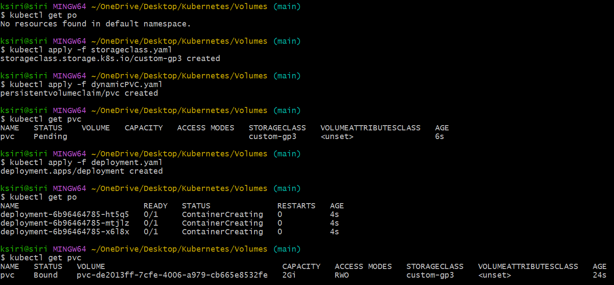
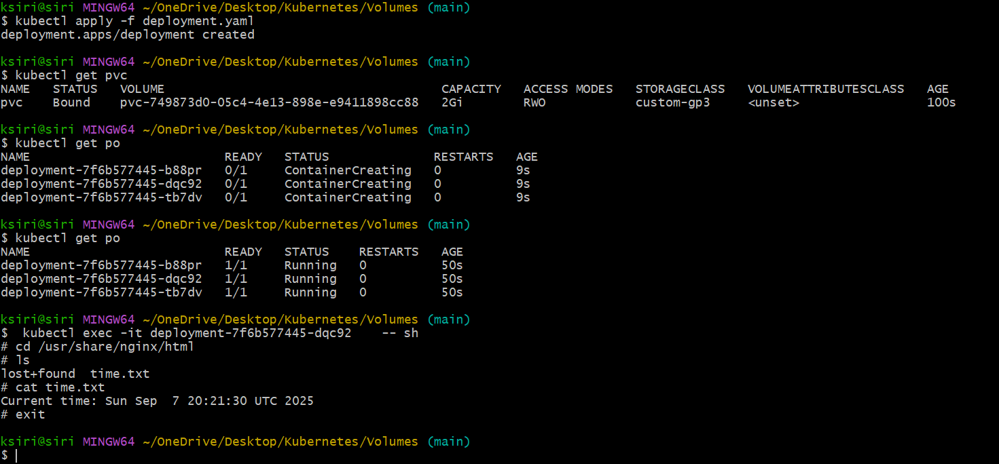
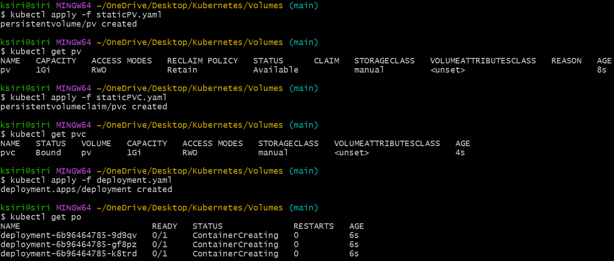
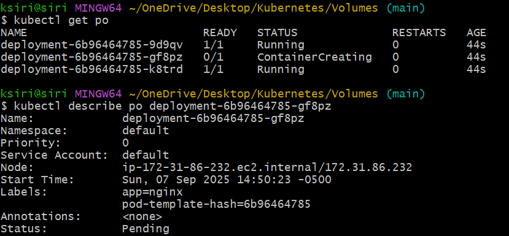

# Volumes
Volumes are used to provide persistent storage for containers in a Kubernetes cluster. They allow data to be shared between containers and persist beyond the lifecycle of a single container.
Volumes can EBS, EFS, S3, Azure Disk, Azure File, GCP Persistent Disk, NFS, iSCSI, CephFS, GlusterFS, HostPath, EmptyDir, ConfigMap, Secret, DownwardAPI, CSI and more.
The volume created using above storage classes can be *mounted* to one or more containers in a Pod, allowing them to read and write data to the same storage location.
Volumes can be used to store application data, configuration files, logs, and other types of data that need to persist beyond the lifecycle of a single container.

In kubernetes, the components used for managing storage are:
- PV(Persistent Volume) - a piece of storage in the cluster that has been provisioned by an administrator or dynamically provisioned using Storage Classes.
- PVC(Persistent Volume Claim) - a request for storage by a user. It specifies the size and access modes of the desired storage.
- Storage Class - a way to describe the "classes" of storage available in a cluster. Different classes might map to quality-of-service levels, or to backup policies, or to arbitrary policies determined by the cluster administrators.

Volumes can be provisioned in two ways: statically and dynamically.
Static provisioning: In static provisioning, an administrator creates a PV manually. PVC is created by user to request storage. The PVC is then bound to an available PV that matches the requested size and access modes. A cluster can have multiple PVs, and a PV can be bound to only one PVC at a time and PVC chooses PV size greater than or equal to the requested size. For example, if we have PV's with 2GB, 3GB, and 4GB, and a pod requests 1GB, it will be bound to the 2GB PV. The request will be in pending state until a suitable PV is available. This is drawback of static provisioning.

Dynamic provisioning: In dynamic provisioning, a StorageClass is created by the administrator that defines the type of storage to be provisioned. When a user creates a PVC, the storage class specified in the PVC is used to dynamically provision a PV that matches the requested size and access modes. This eliminates the need for an administrator to manually create PVs, making it easier to manage storage in a Kubernetes cluster. 

Reclaim Policy: The reclaim policy of a PV determines what happens to the PV when the PVC that is bound to it is deleted. There are three reclaim policies:
- Retain: The PV is deleted from the cluster, but the underlying storage asset is not deleted. This allows for manual reclamation of the resource by an administrator.
- Delete: The PV and its associated storage asset in the underlying infrastructure are deleted. This is typically used for dynamically provisioned PVs.
- Recycle: The PV is deleted. The underlying storage asset is not deleted but is recycled, meaning that it is scrubbed and made available for a new claim. This reclaim policy is deprecated and should not be used in new deployments.

Volume Access Modes: There are four volume access modes in Kubernetes:
- ReadWriteOnce (RWO): The volume can be mounted as read-write by a single node.
- ReadOnlyMany (ROX): The volume can be mounted as read-only by many nodes.
- ReadWriteMany (RWX): The volume can be mounted as read-write by many nodes.
- ReadWriteOncePod (RWOP): The volume can be mounted as read-write by a single pod.

Volume binding modes: There are two volume binding modes in Kubernetes:
- Immediate: The PV is bound to the PVC as soon as the PVC is created. This is the default binding mode.
- WaitForFirstConsumer: The PV is not bound to the PVC until a pod that uses the PVC is created. This binding mode is useful for scenarios where the PV needs to be created in the same availability zone as the pod that uses it.

Drivers: Kubernetes supports various storage drivers for dynamic provisioning, including:
- AWS EBS
- GCE PD
- Azure Disk
- Cinder (OpenStack)
- Ceph RBD
- GlusterFS
- NFS
- iSCSI
- Local

These drivers allow Kubernetes to interact with different storage backends and provision storage dynamically based on the user's requests. One cluster can have multiple drivers installed, allowing for flexibility in storage options. 
One cluster can have multiple storage classes, each using a different driver and configuration. This allows users to choose the appropriate storage class based on their specific requirements, such as performance, durability, and cost.

## Different ways to add driver to the cluster
1. In-tree drivers: These are built-in drivers that are included with Kubernetes. They are maintained as part of the Kubernetes codebase and are typically used for common storage backends such as AWS EBS, GCE PD, and Azure Disk. In-tree drivers are being deprecated in favor of CSI drivers.
2. CSI (Container Storage Interface) drivers: These are third-party drivers that are developed and maintained outside of the Kubernetes codebase. CSI drivers provide a standardized interface for storage vendors to develop their own drivers that can be used with Kubernetes. CSI drivers are more flexible and extensible than in-tree drivers and are the preferred way to add storage support to Kubernetes.
3. FlexVolume drivers: These are also third-party drivers that are developed and maintained outside of the Kubernetes codebase. FlexVolume drivers provide a way to add support for storage backends that are not supported by in-tree or CSI drivers. However, FlexVolume is being deprecated in favor of CSI drivers.
4. External provisioners: These are separate components that run outside of the Kubernetes cluster and are responsible for provisioning storage resources. External provisioners can be used to integrate with storage backends that do not have a native Kubernetes driver. They typically use the Kubernetes API to create and manage PVs and PVCs.
5. Cloud provider-specific drivers: Many cloud providers offer their own storage drivers that are optimized for their specific infrastructure. These drivers may be in-tree or CSI drivers and can provide additional features and functionality beyond what is available with standard Kubernetes drivers.

## Methods to add EBS driver to the cluster
1. In-tree driver: The AWS EBS in-tree driver is included with Kubernetes and can be used to provision EBS volumes for use with Kubernetes pods. This driver is being deprecated in favor of the CSI driver.
2. CSI driver: The AWS EBS CSI driver is a third-party driver that provides a standardized interface for provisioning EBS volumes in Kubernetes. This driver is more flexible and extensible than the in-tree driver and is the preferred way to add EBS support to Kubernetes.
3. External provisioner: The AWS EBS external provisioner is a separate component that runs outside of the Kubernetes cluster and is responsible for provisioning EBS volumes. This provisioner can be used to integrate with EBS in a more customized way than the in-tree or CSI drivers.
4. Cloud provider-specific driver: AWS provides its own EBS driver that is optimized for use with its infrastructure. This driver may provide additional features and functionality beyond what is available with standard Kubernetes drivers.
5. Helm charts: There are Helm charts available that can be used to deploy the AWS EBS CSI driver and external provisioner in a Kubernetes cluster. These charts can simplify the installation and configuration process for users who are not familiar with Kubernetes.

In AWS Console
EKS -> Clusters -> Select your cluster -> Select Add-ons -> Select EBS CSI Driver -> Update

## Implementing Dynamic Provisioning
- Create a storage class file: storageclass.yaml, no need to create PV file.
- Create files: dynamicPVC.yaml, deployment.yaml

The storage class waits until a POD that uses the PVC is created. This way, the PV will be created in the same availability zone as the POD.
## Implementing Static Provisioning
- In AWS Console, create an EBS volume in the same availability zone as your EKS cluster. Note down the volume ID.
- Create files: staticPV.yaml, staticPVC.yaml, deployment.yaml
  
    
The second POD is in pending state because the POD is created in a different availability zone than the EBS volume. So, the volume cannot be attached to the POD.
In order to fix we can use different methods:
1. Setting the volumeBindingMode to WaitForFirstConsumer in the storage class. This will ensure that the PV is not bound to the PVC until a POD that uses the PVC is created. This way, the PV will be created in the same availability zone as the POD.
2. Using AWS EFS or S3 instead of EBS. These storage options are not tied to a specific availability zone and can be accessed from any node in the cluster.
3. Using taints and tolerations to ensure that the POD is scheduled on a node in the same availability zone as the EBS volume.